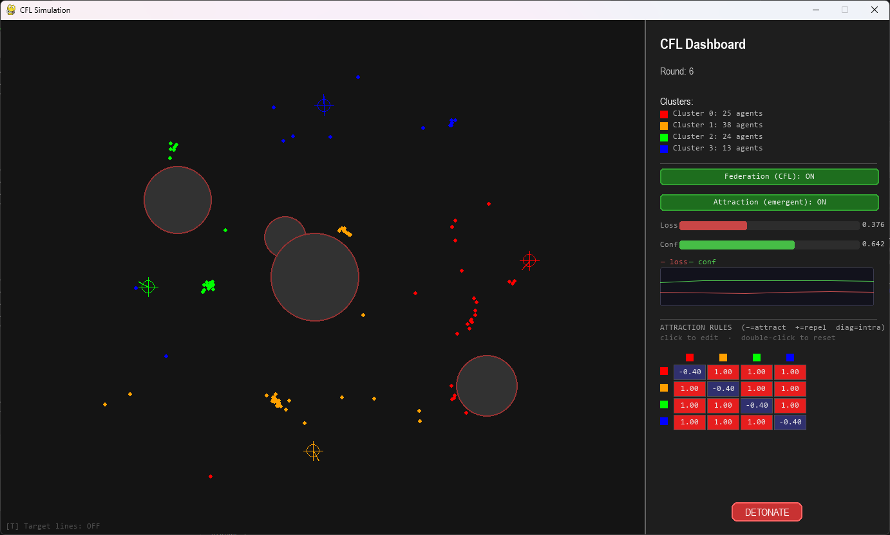
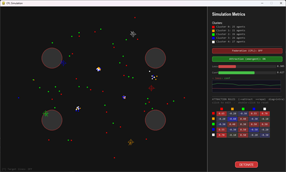
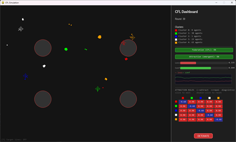
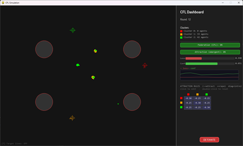
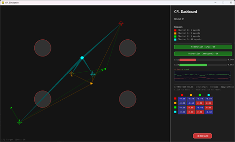
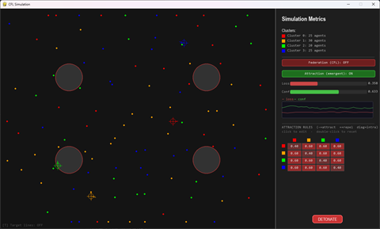
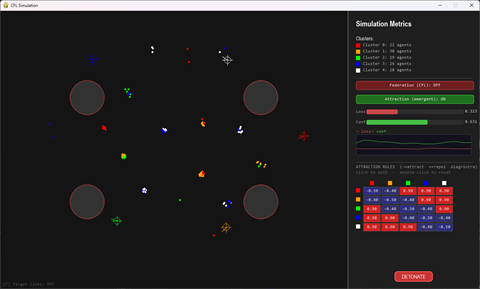
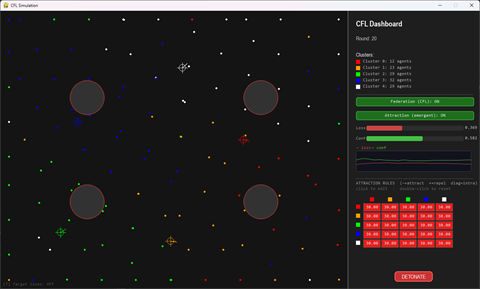
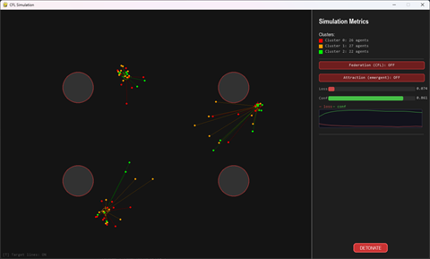
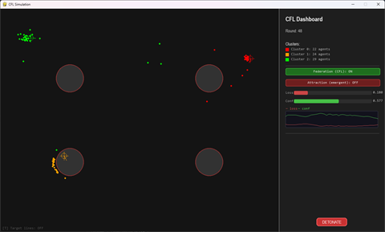

# Emergent Garden — Clustered Federated Learning in a Multi-Agent System

> **Diplomski rad / Master's thesis project.**
> Simulacija dvosmjerne povezanosti između **kognitivne domene** (federalno učenje
> modela u grozdovima) i **fizikalne domene** (prostorna dinamika agenata), iz koje
> izviru kolektivni obrasci koji nisu unaprijed programirani.
>
> A simulation of the **bidirectional coupling** between a *cognitive domain*
> (clustered federated learning of agent models) and a *physical domain* (spatial
> agent dynamics), from which collective patterns **emerge** without being
> explicitly programmed.



---

## Sadržaj / Table of contents

1. [Sažetak / Abstract](#sažetak--abstract)
2. [Teorijske osnove / Theoretical foundations](#teorijske-osnove--theoretical-foundations)
3. [Arhitektura sustava / System architecture](#arhitektura-sustava--system-architecture)
4. [Dvosmjerna povezanost / Bidirectional coupling](#dvosmjerna-povezanost--bidirectional-coupling)
5. [Mehanizam grozdne agregacije / Cluster aggregation (IFCA)](#mehanizam-grozdne-agregacije--cluster-aggregation-ifca)
6. [Code-level technical reference](#code-level-technical-reference)
7. [Installation](#installation)
8. [Running the simulation](#running-the-simulation)
9. [Configuration reference](#configuration-reference)
10. [Evaluation & experiment design / Vrednovanje](#evaluation--experiment-design--vrednovanje)
11. [Visualization & controls](#visualization--controls)
12. [Project structure](#project-structure)
13. [Credits & license](#credits--license)

---

## Sažetak / Abstract

**(HR)** Razumijevanje izvirućeg ponašanja u višeagentskim sustavima predstavlja
značajan izazov u području raspodijeljenih inteligentnih sustava. Ovaj projekt
modelira **dvosmjernu povezanost** između dvije razine sustava:

- **Kognitivna razina** — svaki agent uči vlastiti model, a modeli se **spontano
  dijele u grozdove (klastere)** i agregiraju putem federalnog učenja.
- **Fizikalna razina** — agenti se kreću u 2D prostoru, međusobno se privlače i
  odbijaju, zaobilaze prepreke i odbijaju se od zidova.

Iz interakcije te dvije razine — naučeni model utječe na gibanje, a gibanje i
prostorno susjedstvo natrag utječu na model i pripadnost grozdu — nastaju
**složeni kolektivni obrasci koji nisu unaprijed programirani**, već proizlaze iz
jednostavnih pravila na razini pojedinačnog agenta.

**(EN)** This project is a runnable, visual realization of the thesis: a swarm of
particles ("agents") where each agent runs **local model training** and the swarm
performs **Clustered Federated Learning (CFL)** using an **IFCA**-style algorithm
(Ghosh et al., 2020). Clusters form, **split, and merge spontaneously** based on
what the agents learn. The learned model feeds back into each agent's physical
motion, and the physical motion feeds back into the learning — a closed
bidirectional loop whose emergent collective patterns are the object of study.

The simulation is instrumented end-to-end: every federation round is logged to CSV
and rendered into comparison plots, and a built-in **2×2 ablation** (CFL on/off ×
emergent physics on/off) isolates the contribution of each coupling direction.

---

## Teorijske osnove / Theoretical foundations

### 1. Federalno učenje / Federated Learning

**(HR)** Federalno učenje je pristup raspodijeljenom strojnom učenju u kojem više
"klijenata" uči lokalne modele na vlastitim podacima, a zajednički model nastaje
**agregacijom** (npr. usrednjavanjem) lokalnih modela, bez razmjene sirovih
podataka. Ključni izazov su **non-IID podaci**: svaki klijent vidi sustavno
drugačiju distribuciju.

**(EN)** In this simulation each particle is a federated *client*. Its "data" is the
geometry it experiences — direction to its personal target, obstacle pressure,
neighborhood. Crucially, each particle is born with a fixed **non-IID directional
bias** (the `_local_bias` vector in [`particle.py`](https://github.com/andrijakrklec/emergent-garden/blob/HEAD/src/particle.py)): it
*systematically misperceives* the ideal heading. A single agent learning alone can
never average this bias away; **federation across a cluster cancels it**, which is
precisely why CFL improves the loss metric and solo learning does not.

### 2. Grupiranje u grozdove / Clustering — IFCA

**(HR)** Kada klijenti pripadaju različitim "skupinama" s različitim optimalnim
modelima, jedan globalni model nije dovoljan. **Grozdno (klasterirano) federalno
učenje** rješava to tako da klijente grupira i agregira model **po grozdu**. Ovdje
se koristi **IFCA** (*Iterative Federated Clustering Algorithm*): svaki klijent
sam bira grozd čiji mu emitirani model daje najmanji gubitak.

**(EN)** IFCA replaces a fixed assignment with an **argmin-loss assignment**: every
round, each cluster broadcasts an aggregated model θ_k; each particle evaluates
*every* θ_k against its own situation and joins the cluster with the lowest loss
([`run_cfl_round`](https://github.com/andrijakrklec/emergent-garden/blob/HEAD/src/cfl.py)). The number of clusters is not
fixed — clusters **split** when their members disagree and **merge** when they
become redundant (`MIN_CLUSTERS = 2`, `MAX_CLUSTERS = 6`).

### 3. Izviruće ponašanje / Emergent behavior

**(HR)** Izviruće (emergentno) ponašanje označava složene kolektivne obrasce koji
nisu eksplicitno programirani, nego nastaju iz jednostavnih lokalnih pravila i
interakcija među agentima. U ovom sustavu nijedno pravilo ne nalaže "formiraj
jato" ili "podijeli grozd na dva" — ti obrasci **izviru** iz kombinacije
privlačenja/odbijanja, izbjegavanja prepreka i federalne dinamike učenja.

**(EN)** The emergent layer descends from the original *Emergent Garden* particle
sandbox (see [Credits](#credits--license)). Simple per-pair attraction/repulsion
rules (`apply_physics_rules` in [`game.py`](https://github.com/andrijakrklec/emergent-garden/blob/HEAD/src/game.py), built on the pure [`physics.py`](https://github.com/andrijakrklec/emergent-garden/blob/HEAD/src/physics.py) force library) produce flocking,
splitting, and reorganization that no single rule encodes.

---

## Arhitektura sustava / System architecture

The system is split into two domains that share the same population of agents.

### Kognitivna domena / Cognitive domain

Each agent carries an **8-dimensional model vector** (`Particle.model`,
defined in [`particle.py`](https://github.com/andrijakrklec/emergent-garden/blob/HEAD/src/particle.py)). The first two dimensions are the
**persistent learned identity** used for clustering (`IDENTITY_SLICE = slice(0, 2)`);
the rest are situational signals fed *from* the physical domain:

| Idx | Name                | Meaning                                              | Set by |
|-----|---------------------|------------------------------------------------------|--------|
| 0,1 | `dir_x`, `dir_y`    | Learned heading (unit vector) — the agent's identity | `local_train` |
| 2   | `confidence`        | How consistently it converges (0–1, slow EMA)        | `local_train` |
| 3   | `obstacle_pressure` | Decaying memory of recent obstacle proximity         | `local_train` |
| 4   | `peer_alignment`    | Cosine similarity to same-cluster neighbors          | `update_peer_alignment` |
| 5   | `rounds_stable`     | Normalized rounds since last cluster change           | `run_cfl_round` |
| 6   | `local_loss`        | Normalized distance + directional error to target     | `local_train` |
| 7   | `drift_velocity`    | Normalized EMA of speed                                | `local_train` |

The cognitive domain runs two processes:

- **Local training** — `local_train()` ([`particle.py`](https://github.com/andrijakrklec/emergent-garden/blob/HEAD/src/particle.py)): each
  agent nudges its heading toward its (bias-corrupted) ideal direction, blended
  with obstacle avoidance, and updates confidence/pressure/loss.
- **Federation** — `run_cfl_round()` ([`cfl.py`](https://github.com/andrijakrklec/emergent-garden/blob/HEAD/src/cfl.py)): the IFCA round described
  [below](#mehanizam-grozdne-agregacije--cluster-aggregation-ifca).

### Fizikalna domena / Physical domain

`apply_physics_rules()` ([`game.py`](https://github.com/andrijakrklec/emergent-garden/blob/HEAD/src/game.py)) integrates
motion each physics tick, delegating the force math to the pure
[`physics.py`](https://github.com/andrijakrklec/emergent-garden/blob/HEAD/src/physics.py) library:

- **Inter-agent forces** — attraction/repulsion governed by cluster membership and
  the per-pair **rules matrix** (intra-cluster = diagonal, inter-cluster = off-diagonal).
- **Emergency repulsion** — always on, prevents agents from stacking.
- **Obstacle avoidance** — a soft pre-contact repulsion zone plus hard collision
  resolution.
- **Wall collisions** — elastic bounce inside the 1000×800 simulation area.

### Threading model

The cognitive/physical simulation and the GUI run on **separate threads**:

- `SimulationThread` (daemon, [`game.py`](https://github.com/andrijakrklec/emergent-garden/blob/HEAD/src/game.py)) owns *all* state and steps physics at `PHYSICS_HZ = 60`.
- `Game` (main thread, [`gui.py`](https://github.com/andrijakrklec/emergent-garden/blob/HEAD/src/gui.py)) renders at `FRAME_RATE = 60` by reading an immutable
  `SimSnapshot` under a lock, and sends user actions back through a `queue.Queue`.

This keeps the physics loop deterministic and decoupled from rendering/input latency.

---

## Dvosmjerna povezanost / Bidirectional coupling

The two domains are not independent — they form a closed loop:

```
            KOGNITIVNA DOMENA / COGNITIVE DOMAIN
        per-agent model θ_i   ·   IFCA cluster model θ_k
                  │                              ▲
   DOWN (cognitive → physical)      UP (physical → cognitive)
                  │                              │
   model[0:2]  → behavioral force    peer_alignment ← spatial neighborhood
   confidence  → force magnitude     obstacle_pressure ← position vs obstacles
   cluster_id  → attract / repel     local_loss, drift ← position vs target
                  │                   IFCA assignment ← distance to cluster targets
                  ▼                              │
            FIZIKALNA DOMENA / PHYSICAL DOMAIN
        position · velocity · collisions · neighborhoods
```

**Cognitive → Physical** (the model drives motion):
- The learned heading `model[0:2]`, scaled by `confidence` (`model[2]`) and
  amplified by `obstacle_pressure`, becomes a **behavioral force**
  (`BEHAVIORAL_FORCE = 30.0`, a [`cfl_params.py`](https://github.com/andrijakrklec/emergent-garden/blob/HEAD/src/cfl_params.py) tunable applied in [`game.py`](https://github.com/andrijakrklec/emergent-garden/blob/HEAD/src/game.py)).
- An agent's `cluster_id` selects which **attraction/repulsion rule** applies to
  every pairwise interaction.

**Physical → Cognitive** (motion reshapes the model and clustering):
- `update_peer_alignment()` ([`particle.py`](https://github.com/andrijakrklec/emergent-garden/blob/HEAD/src/particle.py)) sets
  `model[4]` from the headings of **spatial** neighbors in the same cluster.
- Position relative to obstacles and targets sets `obstacle_pressure`, `local_loss`,
  and `drift_velocity` inside `local_train`.
- The **IFCA assignment** itself depends on each agent's physical distance to each
  cluster's spatial target (`_ifca_score`) — so *where* an agent is
  influences *which model* it federates into.

Because the loop is closed, toggling either direction changes the global outcome —
which is exactly what the [2×2 ablation](#evaluation--experiment-design--vrednovanje)
measures.

---

## Mehanizam grozdne agregacije / Cluster aggregation (IFCA)

A federation round fires every `cluster_update_interval` physics steps.
`run_cfl_round()` ([`cfl.py`](https://github.com/andrijakrklec/emergent-garden/blob/HEAD/src/cfl.py)) performs:

1. **Broadcast** — build each cluster's model θ_k as a **confidence-weighted mean**
   of its members (`_compute_cluster_models`). Empty clusters get a
   seed vector pointing from center toward their target.
2. **Assignment (argmin loss)** — each agent scores every θ_k via `_ifca_score`
   (geometric distance + directional alignment to that cluster's target) and joins
   the lowest-loss cluster.
3. **Hysteresis** — an agent only switches if the new cluster is at least
   `MIGRATION_HYSTERESIS = 0.6` (60%) better, preventing flip-flopping between
   near-equivalent clusters.
4. **Aggregation with age-adaptive blend** — members blend toward θ_k. Newborn
   clusters keep more local state (`BLEND_LOCAL_NEW = 0.75`) and mature over
   `BLEND_MATURITY_ROUNDS = 15` toward `BLEND_LOCAL_MATURE = 0.40`, so a fresh split
   doesn't instantly re-merge.
5. **Straggler rescue** — agents with high loss and near-zero drift (stuck) are
   reassigned to the nearest cluster target.
6. **Restructuring** (after a cooldown):
   - **MERGE** — absorb tiny clusters (`< MIN_CLUSTER_SIZE = 3`), or merge two
     mature clusters whose headings are similar (`MERGE_SIMILARITY_THRESHOLD = 0.92`)
     or whose targets have drifted within `MERGE_TARGET_DISTANCE = 120 px`.
   - **SPLIT** — when a cluster's members **disagree on heading**
     (`SPLIT_COHERENCE_THRESHOLD = 0.70`) or its loss is high
     (`SPLIT_LOSS_THRESHOLD = 0.30`), 2-means on member heading vectors carves off a
     new cluster.

All thresholds and weights above are defined in
[`cfl_params.py`](https://github.com/andrijakrklec/emergent-garden/blob/HEAD/src/cfl_params.py)
and read through getter functions (e.g. `get_split_loss_threshold()`).

> **Why IFCA and not plain KMeans?** Earlier versions used KMeans on the identity
> vectors (see commit `changed kmeans to ifca for better clustering`). Under IFCA,
> assignment is driven by *predictive loss under each broadcast model* rather than
> raw feature distance, which clusters the biased agents far more cleanly. A KMeans
> fit is still run at the end purely to preserve the `.inertia_` / `.n_clusters`
> contract that the logger reads.

---

## Code-level technical reference

| File | Responsibility |
|------|----------------|
| [`main.py`](https://github.com/andrijakrklec/emergent-garden/blob/HEAD/main.py) | Entry point. Parses `--config`, constructs `Game`, runs the loop. |
| [`src/gui.py`](https://github.com/andrijakrklec/emergent-garden/blob/HEAD/src/gui.py) | `Game` — the pygame front-end: renders `SimSnapshot`s and forwards input. |
| [`src/game.py`](https://github.com/andrijakrklec/emergent-garden/blob/HEAD/src/game.py) | `SimulationThread` (all sim state + the physics/federation step loop), `SimSnapshot`, the `apply_physics_rules` tick, and config loading/merging. |
| [`src/particle.py`](https://github.com/andrijakrklec/emergent-garden/blob/HEAD/src/particle.py) | `Particle` model, `local_train` (cognitive update), and `update_peer_alignment`. |
| [`src/cfl.py`](https://github.com/andrijakrklec/emergent-garden/blob/HEAD/src/cfl.py) | IFCA federation: `run_cfl_round` (+ merge/split helpers), `compute_cluster_stats`, and `instantiate_group`. |
| [`src/cfl_params.py`](https://github.com/andrijakrklec/emergent-garden/blob/HEAD/src/cfl_params.py) | CFL/IFCA tunables (split/merge thresholds, blend schedule, bias, hysteresis) exposed via getter functions. |
| [`src/physics.py`](https://github.com/andrijakrklec/emergent-garden/blob/HEAD/src/physics.py) | Pure, dependency-free force library: gravity, emergency repulsion, attraction/repulsion coefficient, obstacle push, velocity integration. |
| [`src/constants.py`](https://github.com/andrijakrklec/emergent-garden/blob/HEAD/src/constants.py) | Simulation dimensions, frame rate, particle/physics constants, colors, `CLUSTER_PALETTE`. |
| [`src/utils/sim_logger.py`](https://github.com/andrijakrklec/emergent-garden/blob/HEAD/src/utils/sim_logger.py) | `SimLogger` — per-round CSV/JSONL logging and matplotlib plot generation. |
| [`src/utils/rounds_plotter.py`](https://github.com/andrijakrklec/emergent-garden/blob/HEAD/src/utils/rounds_plotter.py) | Standalone post-hoc re-plotter for a run's `rounds.csv` (`python -m src.utils.rounds_plotter`). |
| [`tools/run_all.py`](https://github.com/andrijakrklec/emergent-garden/blob/HEAD/tools/run_all.py) | Launches the four ablation configs as parallel processes. |
| [`config.json`](https://github.com/andrijakrklec/emergent-garden/blob/HEAD/config.json) | Master config (forces, clusters, obstacles, toggles, rules). |
| [`configs/`](https://github.com/andrijakrklec/emergent-garden/tree/HEAD/configs) | Per-experiment overrides; only list keys that differ from master. |

### Key entry points

- **Physics step**: `SimulationThread._step()` ([`game.py`](https://github.com/andrijakrklec/emergent-garden/blob/HEAD/src/game.py)) — drifts
  targets, runs local training, fires federation rounds, applies physics, samples trails.
- **Federation round**: `run_cfl_round()` ([`cfl.py`](https://github.com/andrijakrklec/emergent-garden/blob/HEAD/src/cfl.py)).
- **Snapshot for GUI**: `SimulationThread._build_snapshot()` → immutable
  `SimSnapshot` dataclass.

### Generating API docs (Doxygen)

Every module, class, and public function carries a Doxygen-style docblock
(`@brief`, `@param`, `@return`). A [`Doxyfile`](https://github.com/andrijakrklec/emergent-garden/blob/HEAD/Doxyfile) is included; build
browsable HTML API documentation with:

```sh
doxygen Doxyfile
```

Output is written to `docs/doxygen/html/index.html` (this README is used as the
front page). Install Doxygen first if needed: `choco install doxygen.install`
(Windows), `brew install doxygen` (macOS), or `apt install doxygen` (Debian/Ubuntu).

---

## Installation

Requires **Python 3.11+**. Dependencies are pinned in
[`requirements.txt`](https://github.com/andrijakrklec/emergent-garden/blob/HEAD/requirements.txt) (pygame, numpy, scikit-learn, matplotlib).

```sh
git clone https://github.com/andrijakrklec/emergent-garden.git
cd emergent-garden

# create + activate a virtual environment
python -m venv .venv --prompt="emergent-garden"
# Windows (PowerShell):
.\.venv\Scripts\Activate.ps1
# macOS / Linux:
source ./.venv/bin/activate

python -m pip install -r requirements.txt
```

---

## Running the simulation

**Single run** (uses the master [`config.json`](https://github.com/andrijakrklec/emergent-garden/blob/HEAD/config.json)):

```sh
python main.py
```

**Specific configuration**:

```sh
python main.py --config configs/cfl_on__emergent_on.json
```

**All four ablation configs at once** (one pygame window + log directory each):

```sh
python tools/run_all.py
```

Each run writes a timestamped directory under `logs/run_<timestamp>[_tags]/` and,
on exit (or every 20 rounds), renders its plots there.

---

## Configuration reference

Configuration is resolved in **three merged layers**, each overriding the previous
(`_load_merged_config`, [`game.py`](https://github.com/andrijakrklec/emergent-garden/blob/HEAD/src/game.py)):

1. **master** [`config.json`](https://github.com/andrijakrklec/emergent-garden/blob/HEAD/config.json) — globals plus the `emergent_preset` selector;
2. the **emergent preset** it names (`configs/emergent/<name>.json`) — the attract/repel personality;
3. the per-run **`--config`** file (used by `run_all.py`) — e.g. the ablation toggles.

`pair_rules` are deep-merged per entry, so any layer can change individual pairs
without repeating the whole table. Keys beginning with `_` are treated as comments.

| Key | Type | Meaning |
|-----|------|---------|
| `emergent_preset` | str \| null | Name of a preset in `configs/emergent/` to overlay (e.g. `"orbits"`). `null` = use this file's own `g_*`/`pair_rules`/`num_clusters` (or built-in defaults). |
| `cfl_enabled` | bool | Enable federation rounds (the cognitive coupling). |
| `attraction_enabled` | bool | Enable inter-agent attraction/repulsion (the emergent physical coupling). Must be **true** to see a preset. Emergency anti-stacking repulsion stays on regardless. |
| `max_rounds` | int \| null | Stop after this many rounds. `null` = run indefinitely. |
| `obstacles` | null \| int \| list | `null` = 4 random; int N = N random; list of `[x,y,r]` or `{"x","y","r"}` = exact layout. SIM area is 1000×800. |
| `force_scale` | float | Multiplies all `g` values before use, so preset/config values stay in a readable ≈ −1…+1 range. |
| `num_clusters` | int 2–6 \| null | Initial cluster count (usually set by the preset). `null` = random each run. |
| `g_attract` | float | Default **intra-cluster** force, negative = attract (usually set by the preset). |
| `g_repel` | float | Default **inter-cluster** force, positive = repel (usually set by the preset). |
| `pair_rules` | object | Per-pair overrides keyed `"i-j"` (i ≤ j); diagonal = intra-cluster, off-diagonal = cross-cluster (usually set by the preset). |

The four shipped experiment files in [`configs/`](https://github.com/andrijakrklec/emergent-garden/tree/HEAD/configs) each set only
`cfl_enabled` and `attraction_enabled`:

| File | CFL | Emergent |
|------|-----|----------|
| `configs/cfl_on__emergent_on.json`   | ✅ | ✅ |
| `configs/cfl_on__emergent_off.json`  | ✅ | ❌ |
| `configs/cfl_off__emergent_on.json`  | ❌ | ✅ |
| `configs/cfl_off__emergent_off.json` | ❌ | ❌ |

### Emergent presets

Pick a behaviour by name with `"emergent_preset"` in [`config.json`](https://github.com/andrijakrklec/emergent-garden/blob/HEAD/config.json); each
file in [`configs/emergent/`](https://github.com/andrijakrklec/emergent-garden/tree/HEAD/configs/emergent) sets `num_clusters`, `g_attract`,
`g_repel` and `pair_rules`. Set `attraction_enabled: true` to see them.

| Preset | Clusters | Behaviour |
|--------|----------|-----------|
| `default` | 5 | Original hand-tuned mixed matrix (mixed cohesion / spread). |
| `cells`   | 5 | Tight cohesive blobs that strongly repel each other — territorial cells. |
| `swarm`   | 3 | Loosely cohesive groups that also attract each other — one drifting super-swarm. |
| `orbits`  | 4 | Central core (cluster 0) attracts satellites that repel each other — ring / orbit. |
| `gas`     | 4 | Clusters self-repel and repel each other — particles disperse like a gas. |
| `chains`  | 5 | Only adjacent clusters attract (0-1-2-3-4) — linked strands. |
| `scramble`| 5 | Universal strong repulsion — every agent repels every other, so the swarm scatters and can't reach its anchors (worst-case ablation stress test). |

<br>
**default** — balanced cohesion / spread

<br>
**cells** — tight cohesive blobs that strongly repel each other

<br>
**swarm** — one drifting super-swarm

<br>
**orbits** — central core attracts satellites that repel each other

<br>
**gas** — every cluster repels; particles disperse

<br>
**chains** — only adjacent clusters attract (0-1-2-3-4)

<br>
**scramble** — universal repulsion; the swarm can't reach its anchors

Add your own by dropping a `configs/emergent/<name>.json` with the same fields and
setting `emergent_preset` to `<name>`.

---

## Evaluation & experiment design / Vrednovanje

### The 2×2 ablation

The two coupling directions are toggled independently to isolate their effects:

- **CFL on/off** isolates the *cognitive* contribution (does federation reduce loss
  by averaging out the non-IID bias?).
- **Emergent on/off** isolates the *physical* contribution (do the attraction rules
  change clustering and convergence?).

`run_all.py` launches all four simultaneously so the runs are directly comparable.
The metrics tracked **every round regardless of mode** (so toggling is visible) are
average loss and confidence (tracked each round in `SimulationThread._step`).

<br>
**CFL off · emergent off** — no coupling; agents just drift to personal targets

<br>
**CFL on · emergent off** — federation only; clusters converge on their anchors

<br>
**CFL off · emergent on** — physics only; spatial forces, no federation

<br>
**CFL on · emergent on** — full coupling; federated clusters + emergent physics

### Logged artifacts

`SimLogger` ([`src/utils/sim_logger.py`](https://github.com/andrijakrklec/emergent-garden/blob/HEAD/src/utils/sim_logger.py)) writes per run:

| File | Contents |
|------|----------|
| `rounds.csv` | One row per round: inertia, migrations, avg confidence/loss/peer/pressure/drift/stability. |
| `migrations.csv` | One row per (round, src, dst) migration event. |
| `cluster_sizes.csv` | Per (round, cluster): size, model health, model divergence, spatial spread. |
| `events.jsonl` | Split / merge / explosion events, one JSON object per line. |
| `sim_log.txt` | Human-readable mirror of the terminal output. |

### Generated plots

| Plot | Shows |
|------|-------|
| `global_metrics.png` | 2×3 grid: inertia, cluster count, migrations (CFL row) + confidence, loss, peer-alignment. CFL-only panels are greyed out when disabled. |
| `cluster_sizes.png` | Per-cluster population over rounds, with split/merge/explosion markers. |
| `cluster_health.png` | Per-cluster confidence and loss (fixed axes for cross-run comparison). |
| `migration_heatmap.png` | Cumulative agent migrations between clusters (CFL only). |
| `cohesion_divergence.png` | Per-cluster model divergence and spatial spread. |

Plots use a consistent dark theme and event markers so runs from different configs
can be visually compared side by side — the "prikladna vizualna interpretacija"
called for in the thesis.

---

## Visualization & controls

The live window is split into the **simulation area** (left) and a **dashboard**
(right sidebar).

**Mouse:**
- **DETONATE** button — scatters all agents and randomizes their models (stress-test
  for re-convergence; logged as an `explosion` event).
- **Federation (CFL)** toggle — turns federation rounds on/off live.
- **Attraction (emergent)** toggle — turns inter-agent forces on/off live.
- **Attraction rules matrix** — click a cell to edit a per-pair force (type a value,
  Enter to commit); **double-click** to reset to default. Visible only when
  attraction is enabled. Manual edits are clamped to [−50, 50].

**Keyboard:**
- **`T`** — toggle target lines (draw each agent's line to its personal inner target).

**Dashboard readouts:** current round, per-cluster agent counts (color-keyed), live
loss/confidence bars, and a rolling sparkline of loss and confidence.

---

## Project structure

```
emergent-garden/
├── main.py                      # entry point (--config)
├── config.json                  # master configuration
├── requirements.txt
├── Doxyfile                     # Doxygen API-doc configuration
├── configs/                     # per-experiment overrides
│   ├── cfl_on__emergent_on.json
│   ├── cfl_on__emergent_off.json
│   ├── cfl_off__emergent_on.json
│   ├── cfl_off__emergent_off.json
│   └── emergent/                # named behaviour presets (default, cells, …)
├── src/
│   ├── game.py                  # SimulationThread engine + SimSnapshot + apply_physics_rules
│   ├── gui.py                   # Game — pygame render/input front-end
│   ├── particle.py              # Particle model, local_train, update_peer_alignment
│   ├── cfl.py                   # IFCA round, clustering, instantiate_group
│   ├── cfl_params.py            # CFL/IFCA tunables (getters)
│   ├── physics.py               # pure force library
│   ├── constants.py             # dimensions, rates, physics constants, colors, palette
│   └── utils/
│       ├── sim_logger.py        # CSV/JSONL logging + matplotlib plots
│       └── rounds_plotter.py    # standalone rounds.csv re-plotter
├── tools/
│   ├── run_all.py               # launch the 2×2 ablation in parallel
│   └── rounds_plotter_form.html # command builder for rounds_plotter
├── docs/images/                 # screenshots
└── logs/                        # per-run output (CSV + plots); gitignored
```

---

## Credits & license

This thesis project builds on the original **Emergent Garden** particle sandbox by
**Vishal Paudel** ([`@vishalpaudel`](https://github.com/vishalpaudel/emergent-garden)),
which provided the base emergent-physics layer. The Clustered Federated Learning
(IFCA), bidirectional cognitive/physical coupling, logging/evaluation pipeline, and
configuration system were added as part of this work.

The IFCA algorithm follows **Ghosh, Chung, Yin & Ramchandran (2020),
*An Efficient Framework for Clustered Federated Learning.***

Licensed under the **MIT License** — see the `LICENSE` file.
